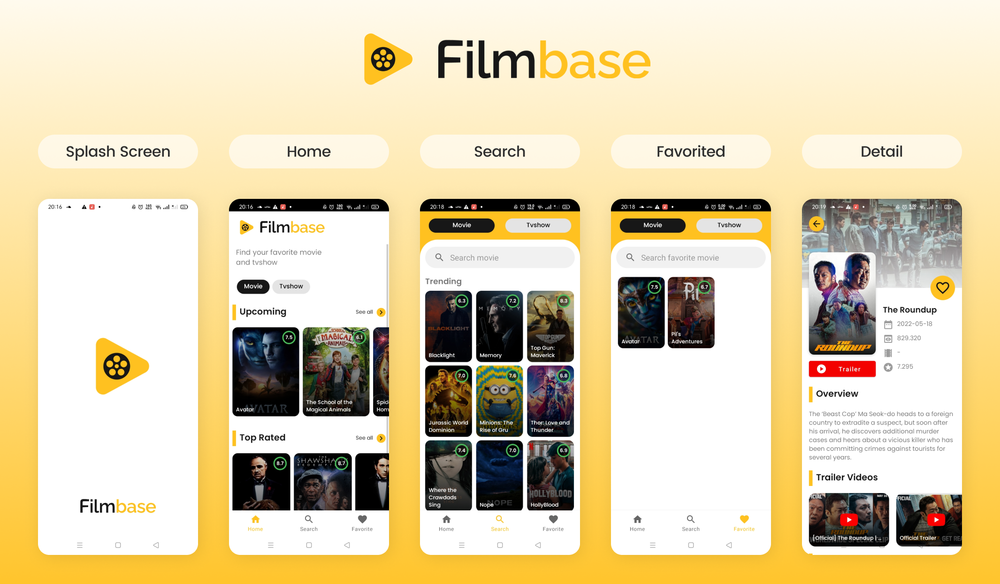

# Filmbase
Movie and Tvshow database app built with Kotlin (Implementing Room, Retrofit, Kotlin Coroutines, MVVM Architecture, Dependency Injection without library, Repository Pattern).

### App Features
* **Movie** - menampilkan daftar movie terbaru
* **TV Show** - menampilkan daftar tv show terbaru
* **Movie Favorite** - menampilkan daftar movie yang sudah ditambahkan sebagai favorite
* **TV Favorite** - menampilkan daftar tv yang sudah ditambahkan sebagai favorite
* **Search Movie & TV** - untuk melakukan pencarian movie & tv

### Screenshot
<span align="center">
 <hr>
 <p align="center"></p>
 <p align="center">Screenshot</p>
 <hr>
 </span>

### API
Api yang digunakan dalam project ini yaitu https://developers.themoviedb.org

Base URL yang digunakan adalah sebagai berikut
```
https://developers.themoviedb.org/3/
```

#### Endpoint Used

|Method | Endpoint | Usage |
| ---- | ---- | --------------- |
|GET| `/search/movie` | Search Movies|
|GET| `/search/tv` | Search TV Shows.| 
|GET| `/movie/{movie_id}` | Get Movie Detail.| 
|GET| `/movie/top_rated` | Get Top Rated Movies.| 
|GET| `/movie/upcoming` | Get Upcoming Movies.| 
|GET| `/movie/{movie_id}/videos` | Get Movie Videos.| 
|GET| `/tv/airing_today` | Get Airing Today Tvshows.| 
|GET| `/tv/top_rated` | Get Top Rated Tvshows.|
|GET| `/tv/{tv_id}` | Get TV Detail.|
|GET| `/tv/{tv_id}/videos` | Get Tvshow Videos.| 

